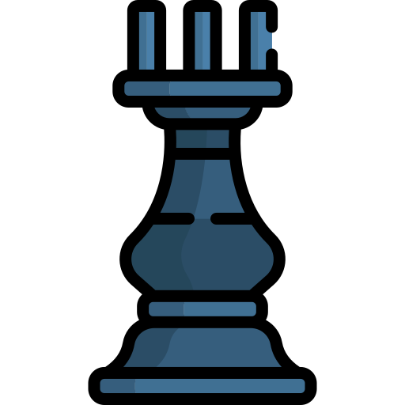
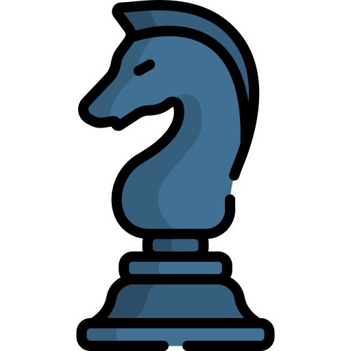
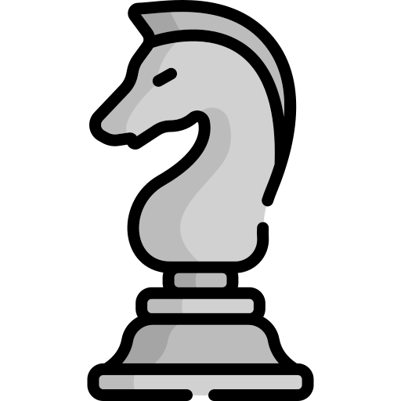

<h1 align="center">Hi 👋, I'm Eric</h1>
<h3 align="center">A passionate high school student interested in full-stack development</h3>
<h4 align="center">Member of <a href="http://github.com/faker-js/faker">Faker</a></h4>
<h4 align="center">Triager for <a href="http://github.com/expressjs/express">Express</a></h4>
<h4 align="center">UI Maintainer of <a href="https://github.com/polygon-isecure/ui">Polygon</a></h4>

  

### what I spent my time on this week 🕒

 

---

### :chess_pawn: Community Chess Game

This is an open chess tournament where ANYONE can play. That's the fun part.  

It's your turn to play! Move a <!-- BEGIN TURN -->black<!-- END TURN --> piece.

<!-- BEGIN CHESS BOARD -->
|   | A | B | C | D | E | F | G | H |   |
|---|:-:|:-:|:-:|:-:|:-:|:-:|:-:|:-:|:-:|
| **8** |  |  |  |  |  |  |  |  | **8** |
| **7** |  |  |  |  |  |  |  |  | **7** |
| **6** |  |  |  |  |  |  |  |  | **6** |
| **5** |  |  |  |  |  |  |  |  | **5** |
| **4** |  |  |  |  |  |  |  |  | **4** |
| **3** |  |  |  |  |  |  |  |  | **3** |
| **2** |  |  |  |  |  |  |  |  | **2** |
| **1** |  |  |  |  |  |  |  |  | **1** |
|   | **A** | **B** | **C** | **D** | **E** | **F** | **G** | **H** |   |
<!-- END CHESS BOARD -->

**It's your turn to move! Choose one from the following table**
<!-- BEGIN MOVES LIST -->
|  FROM  | TO (Just click a link!) |
| :----: | :---------------------- |
| **A7** | [A5](https://github.com/import-brain/import-brain/issues/new?body=Please+do+not+change+the+title.+Just+click+%22Submit+new+issue%22.+You+don%27t+need+to+do+anything+else+%3AD&title=Chess%3A+Move+A7+to+A5), [A6](https://github.com/import-brain/import-brain/issues/new?body=Please+do+not+change+the+title.+Just+click+%22Submit+new+issue%22.+You+don%27t+need+to+do+anything+else+%3AD&title=Chess%3A+Move+A7+to+A6) |
| **B6** | [B5](https://github.com/import-brain/import-brain/issues/new?body=Please+do+not+change+the+title.+Just+click+%22Submit+new+issue%22.+You+don%27t+need+to+do+anything+else+%3AD&title=Chess%3A+Move+B6+to+B5) |
| **B8** | [A6](https://github.com/import-brain/import-brain/issues/new?body=Please+do+not+change+the+title.+Just+click+%22Submit+new+issue%22.+You+don%27t+need+to+do+anything+else+%3AD&title=Chess%3A+Move+B8+to+A6), [C6](https://github.com/import-brain/import-brain/issues/new?body=Please+do+not+change+the+title.+Just+click+%22Submit+new+issue%22.+You+don%27t+need+to+do+anything+else+%3AD&title=Chess%3A+Move+B8+to+C6), [D7](https://github.com/import-brain/import-brain/issues/new?body=Please+do+not+change+the+title.+Just+click+%22Submit+new+issue%22.+You+don%27t+need+to+do+anything+else+%3AD&title=Chess%3A+Move+B8+to+D7) |
| **C7** | [C5](https://github.com/import-brain/import-brain/issues/new?body=Please+do+not+change+the+title.+Just+click+%22Submit+new+issue%22.+You+don%27t+need+to+do+anything+else+%3AD&title=Chess%3A+Move+C7+to+C5), [C6](https://github.com/import-brain/import-brain/issues/new?body=Please+do+not+change+the+title.+Just+click+%22Submit+new+issue%22.+You+don%27t+need+to+do+anything+else+%3AD&title=Chess%3A+Move+C7+to+C6) |
| **D6** | [D5](https://github.com/import-brain/import-brain/issues/new?body=Please+do+not+change+the+title.+Just+click+%22Submit+new+issue%22.+You+don%27t+need+to+do+anything+else+%3AD&title=Chess%3A+Move+D6+to+D5) |
| **D8** | [C8](https://github.com/import-brain/import-brain/issues/new?body=Please+do+not+change+the+title.+Just+click+%22Submit+new+issue%22.+You+don%27t+need+to+do+anything+else+%3AD&title=Chess%3A+Move+D8+to+C8), [D7](https://github.com/import-brain/import-brain/issues/new?body=Please+do+not+change+the+title.+Just+click+%22Submit+new+issue%22.+You+don%27t+need+to+do+anything+else+%3AD&title=Chess%3A+Move+D8+to+D7) |
| **E7** | [E5](https://github.com/import-brain/import-brain/issues/new?body=Please+do+not+change+the+title.+Just+click+%22Submit+new+issue%22.+You+don%27t+need+to+do+anything+else+%3AD&title=Chess%3A+Move+E7+to+E5), [E6](https://github.com/import-brain/import-brain/issues/new?body=Please+do+not+change+the+title.+Just+click+%22Submit+new+issue%22.+You+don%27t+need+to+do+anything+else+%3AD&title=Chess%3A+Move+E7+to+E6) |
| **E8** | [D7](https://github.com/import-brain/import-brain/issues/new?body=Please+do+not+change+the+title.+Just+click+%22Submit+new+issue%22.+You+don%27t+need+to+do+anything+else+%3AD&title=Chess%3A+Move+E8+to+D7) |
| **F7** | [F5](https://github.com/import-brain/import-brain/issues/new?body=Please+do+not+change+the+title.+Just+click+%22Submit+new+issue%22.+You+don%27t+need+to+do+anything+else+%3AD&title=Chess%3A+Move+F7+to+F5), [F6](https://github.com/import-brain/import-brain/issues/new?body=Please+do+not+change+the+title.+Just+click+%22Submit+new+issue%22.+You+don%27t+need+to+do+anything+else+%3AD&title=Chess%3A+Move+F7+to+F6) |
| **G4** | [C8](https://github.com/import-brain/import-brain/issues/new?body=Please+do+not+change+the+title.+Just+click+%22Submit+new+issue%22.+You+don%27t+need+to+do+anything+else+%3AD&title=Chess%3A+Move+G4+to+C8), [D7](https://github.com/import-brain/import-brain/issues/new?body=Please+do+not+change+the+title.+Just+click+%22Submit+new+issue%22.+You+don%27t+need+to+do+anything+else+%3AD&title=Chess%3A+Move+G4+to+D7), [E6](https://github.com/import-brain/import-brain/issues/new?body=Please+do+not+change+the+title.+Just+click+%22Submit+new+issue%22.+You+don%27t+need+to+do+anything+else+%3AD&title=Chess%3A+Move+G4+to+E6), [F3](https://github.com/import-brain/import-brain/issues/new?body=Please+do+not+change+the+title.+Just+click+%22Submit+new+issue%22.+You+don%27t+need+to+do+anything+else+%3AD&title=Chess%3A+Move+G4+to+F3), [F5](https://github.com/import-brain/import-brain/issues/new?body=Please+do+not+change+the+title.+Just+click+%22Submit+new+issue%22.+You+don%27t+need+to+do+anything+else+%3AD&title=Chess%3A+Move+G4+to+F5), [H3](https://github.com/import-brain/import-brain/issues/new?body=Please+do+not+change+the+title.+Just+click+%22Submit+new+issue%22.+You+don%27t+need+to+do+anything+else+%3AD&title=Chess%3A+Move+G4+to+H3), [H5](https://github.com/import-brain/import-brain/issues/new?body=Please+do+not+change+the+title.+Just+click+%22Submit+new+issue%22.+You+don%27t+need+to+do+anything+else+%3AD&title=Chess%3A+Move+G4+to+H5) |
| **G7** | [G5](https://github.com/import-brain/import-brain/issues/new?body=Please+do+not+change+the+title.+Just+click+%22Submit+new+issue%22.+You+don%27t+need+to+do+anything+else+%3AD&title=Chess%3A+Move+G7+to+G5), [G6](https://github.com/import-brain/import-brain/issues/new?body=Please+do+not+change+the+title.+Just+click+%22Submit+new+issue%22.+You+don%27t+need+to+do+anything+else+%3AD&title=Chess%3A+Move+G7+to+G6) |
| **G8** | [F6](https://github.com/import-brain/import-brain/issues/new?body=Please+do+not+change+the+title.+Just+click+%22Submit+new+issue%22.+You+don%27t+need+to+do+anything+else+%3AD&title=Chess%3A+Move+G8+to+F6), [H6](https://github.com/import-brain/import-brain/issues/new?body=Please+do+not+change+the+title.+Just+click+%22Submit+new+issue%22.+You+don%27t+need+to+do+anything+else+%3AD&title=Chess%3A+Move+G8+to+H6) |
| **H7** | [H5](https://github.com/import-brain/import-brain/issues/new?body=Please+do+not+change+the+title.+Just+click+%22Submit+new+issue%22.+You+don%27t+need+to+do+anything+else+%3AD&title=Chess%3A+Move+H7+to+H5), [H6](https://github.com/import-brain/import-brain/issues/new?body=Please+do+not+change+the+title.+Just+click+%22Submit+new+issue%22.+You+don%27t+need+to+do+anything+else+%3AD&title=Chess%3A+Move+H7+to+H6) |
<!-- END MOVES LIST -->

Having fun? Ask a friend to do the next move!

#### How it works

When you click on a link and submit a new issue with the desired move, a GitHub action is triggered, which in turn runs a small python script that performs the specified movement, updates this README file and commits the changes.

Have you spotted a bug? Something missing? Feel free to open an [issue](https://github.com/marcizhu/readme-chess/issues) or contact import-brain (repo owner) and they will try to fix it as soon as possible :D

  
Last 5 moves in this game

<!-- BEGIN LAST MOVES -->

| Move | Author |
| :--: | :----- |
| `F2` to `F3` | [ @TornadicWaluigi](https://github.com/TornadicWaluigi) |
| `B7` to `B6` | [ @peanutz28](https://github.com/peanutz28) |
| `C1` to `F4` | [ @import-brain](https://github.com/import-brain) |
| `D1` to `G4` | [ @AyushSagar16](https://github.com/AyushSagar16) |
| `D2` to `D4` | [ @Glenn-Mendonca](https://github.com/Glenn-Mendonca) |

<!-- END LAST MOVES -->

  
Top 10 most moves across all games

<!-- BEGIN TOP MOVES -->

| Total moves |  User  |
| :---------: | :----- |
| 12 | [@import-brain](https://github.com/import-brain) |
| 5 | [@C-Saunders](https://github.com/C-Saunders) |
| 5 | [@AyushSagar16](https://github.com/AyushSagar16) |
| 3 | [@nayabatir1](https://github.com/nayabatir1) |
| 2 | [@denilsonpy](https://github.com/denilsonpy) |
| 2 | [@afanasy](https://github.com/afanasy) |
| 1 | [@m-GDEV](https://github.com/m-GDEV) |
| 1 | [@Barabazs](https://github.com/Barabazs) |
| 1 | [@njmsaikat](https://github.com/njmsaikat) |
| 1 | [@Biplob14](https://github.com/Biplob14) |

<!-- END TOP MOVES -->

---

Do you want to make your own? Check out [marcizhu/readme-chess](https://github.com/marcizhu/readme-chess)!
