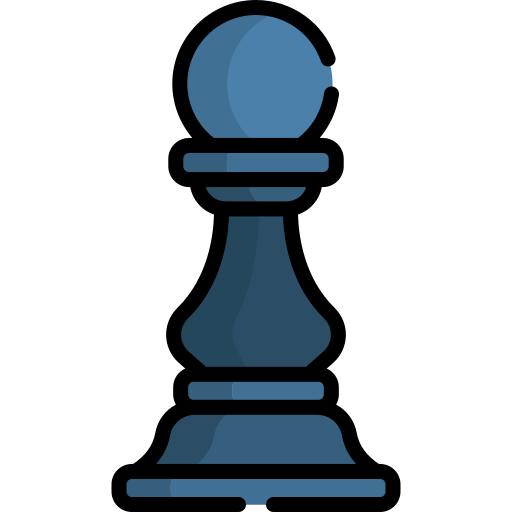
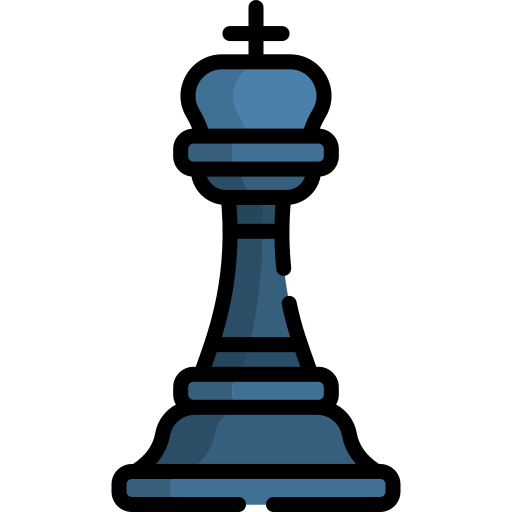
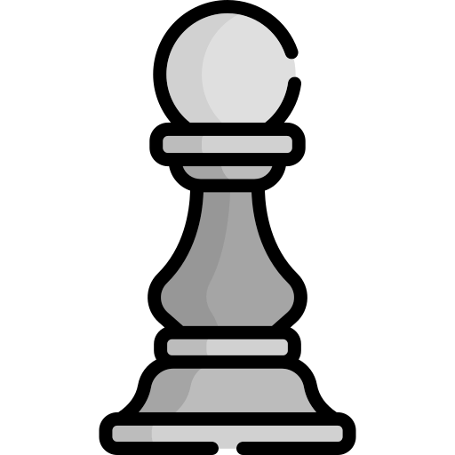
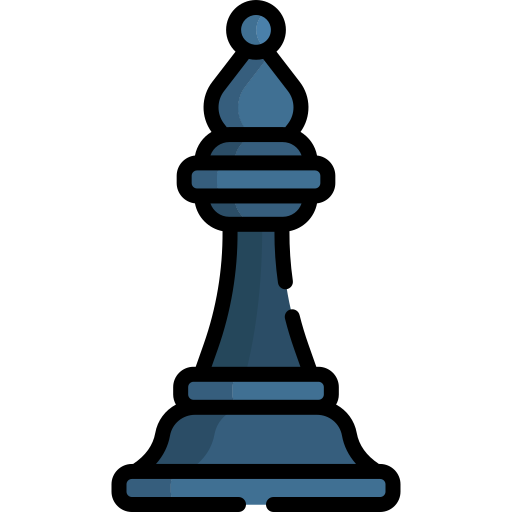
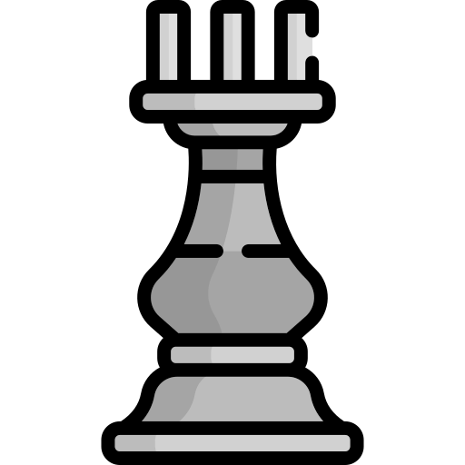
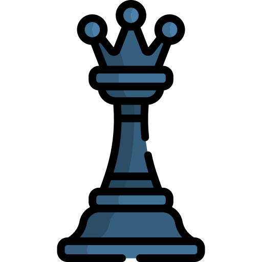
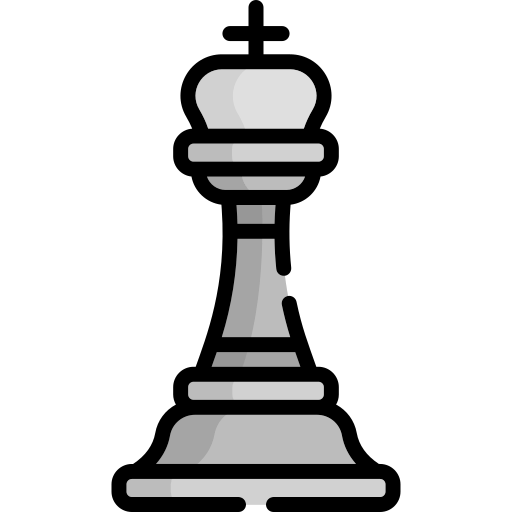
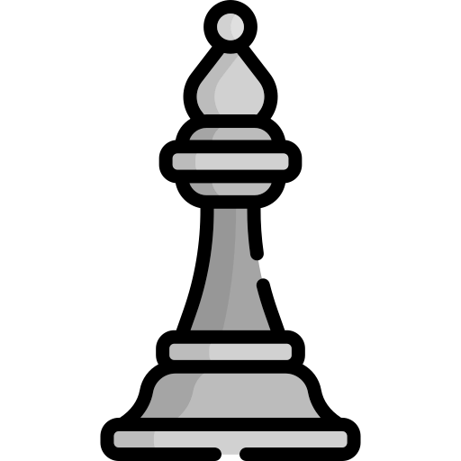

<h1 align="center">Hi 👋, I'm Eric</h1>
<h3 align="center">A passionate high school student interested in full-stack development</h3>
<h4 align="center">Member of <a href="http://github.com/faker-js/faker">Faker</a></h4>
<h4 align="center">Triager for <a href="http://github.com/expressjs/express">Express</a></h4>
<h4 align="center">UI Maintainer of <a href="https://github.com/polygon-isecure/ui">Polygon</a></h4>

  

### what I spent my time on this week 🕒

 

---

### :chess_pawn: Community Chess Game

This is an open chess tournament where ANYONE can play. That's the fun part.  

It's your turn to play! Move a <!-- BEGIN TURN -->white<!-- END TURN --> piece.

<!-- BEGIN CHESS BOARD -->
|   | A | B | C | D | E | F | G | H |   |
|---|:-:|:-:|:-:|:-:|:-:|:-:|:-:|:-:|:-:|
| **8** |  |  |  |  |  |  |  |  | **8** |
| **7** |  |  |  |  |  |  |  |  | **7** |
| **6** |  |  |  |  |  |  |  |  | **6** |
| **5** |  |  |  |  |  |  |  |  | **5** |
| **4** |  |  |  |  |  |  |  |  | **4** |
| **3** |  |  |  |  |  |  |  |  | **3** |
| **2** |  |  |  |  |  |  |  |  | **2** |
| **1** |  |  |  |  |  |  |  |  | **1** |
|   | **A** | **B** | **C** | **D** | **E** | **F** | **G** | **H** |   |
<!-- END CHESS BOARD -->

**It's your turn to move! Choose one from the following table**
<!-- BEGIN MOVES LIST -->
**GAME IS OVER!** [Click here](https://github.com/import-brain/import-brain/issues/new?body=Please+do+not+change+the+title.+Just+click+%22Submit+new+issue%22.+You+don%27t+need+to+do+anything+else+%3AD&title=Chess%3A+Start+new+game) to start a new game :D
<!-- END MOVES LIST -->

Having fun? Ask a friend to do the next move!

#### How it works

When you click on a link and submit a new issue with the desired move, a GitHub action is triggered, which in turn runs a small python script that performs the specified movement, updates this README file and commits the changes.

Have you spotted a bug? Something missing? Feel free to open an [issue](https://github.com/marcizhu/readme-chess/issues) or contact import-brain (repo owner) and they will try to fix it as soon as possible :D

  
Last 5 moves in this game

<!-- BEGIN LAST MOVES -->

| Move | Author |
| :--: | :----- |
| `D8` to `H4` | [ @omarzim](https://github.com/omarzim) |
| `C3` to `B4` | [ @nayabatir1](https://github.com/nayabatir1) |
| `A6` to `B4` | [ @bunyaminkirmizi](https://github.com/bunyaminkirmizi) |
| `G1` to `H2` | [ @AyushSagar16](https://github.com/AyushSagar16) |
| `E4` to `D3` | [ @C-Saunders](https://github.com/C-Saunders) |

<!-- END LAST MOVES -->

  
Top 10 most moves across all games

<!-- BEGIN TOP MOVES -->

| Total moves |  User  |
| :---------: | :----- |
| 10 | [@import-brain](https://github.com/import-brain) |
| 4 | [@C-Saunders](https://github.com/C-Saunders) |
| 4 | [@AyushSagar16](https://github.com/AyushSagar16) |
| 2 | [@afanasy](https://github.com/afanasy) |
| 1 | [@m-GDEV](https://github.com/m-GDEV) |
| 1 | [@Barabazs](https://github.com/Barabazs) |
| 1 | [@njmsaikat](https://github.com/njmsaikat) |
| 1 | [@Biplob14](https://github.com/Biplob14) |
| 1 | [@denilsonpy](https://github.com/denilsonpy) |
| 1 | [@dsebata](https://github.com/dsebata) |

<!-- END TOP MOVES -->

---

Do you want to make your own? Check out [marcizhu/readme-chess](https://github.com/marcizhu/readme-chess)!
